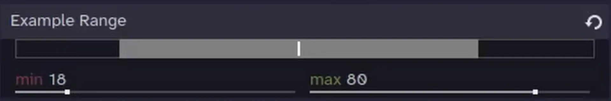
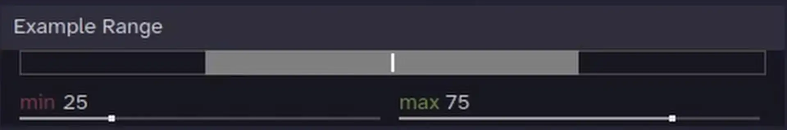
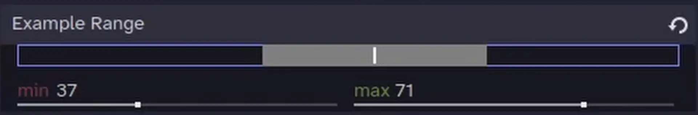
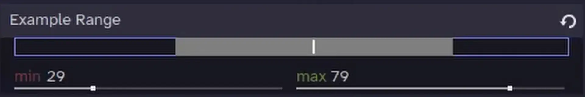
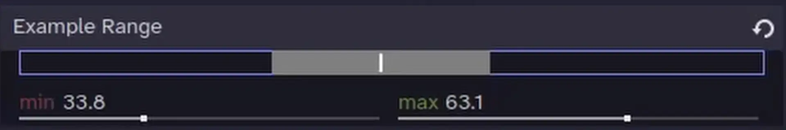
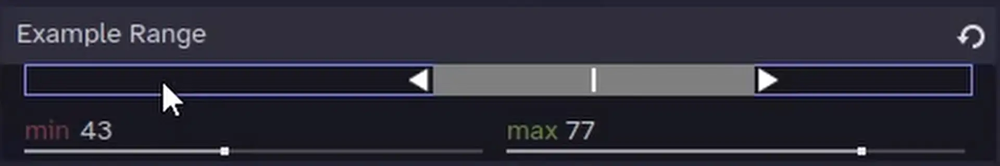

<div align="center">


[](https://godotengine.org/)
[](LICENSE)

</div>

## What is it ?
A Godot editor plugin that provides a `RangeSlider` control for `Vector2` properties in the editor inspector when using `@export_custom(PROPERTY_HINT_RANGE, ...)`.
This feature is a close copy of the `MinMaxPropertyEditor` present in  [ParticleProcessMaterial](https://github.com/godotengine/godot/blob/master/editor/scene/particle_process_material_editor_plugin.cpp) but not exposed in the editor, so i tried as best as i could to convert the cpp code to GDScript and make it seamlessly integrate with the editor.



## What is it for ?

It's a user-friendly alternative to editing two separate float variables for the min and max values of a range and having to create two setter functions to clamp the values.
For example, without the plugin, you would have to do something like this :
```gdscript
@export_range(0.0,100.0,0.1) var position_range_x_min: float = 25.0 :
	set(new_range_x_min):
		position_range_x_min = clampf(new_range_x_min, 0.0, position_range_x_max)
@export_range(0.0,100.0,0.1) var position_range_x_max: float = 75.0 :
	set(new_range_x_max):
		position_range_x_max = clampf(new_range_x_max, position_range_x_min, 100.0)
```

With the plugin, you can just do this :
```gdscript
@export_custom(PROPERTY_HINT_RANGE, "0.0,100.0,0.1") var position_range_x: Vector2 = Vector2(25.0, 75.0)
```

And now you have a handy slider to edit the range !


## What does it do ?

- **Range Editing Slider:** Drag one of the two handles at both ends of the slider to define a min/max range.
- **Inspector Integration:** Automatically replaces `Vector2` properties with a `hint_range` in the Inspector.
- **Draggable Range:** Click and drag the area between the handles to move the entire range at once.
- **Scalable Range:** Hold `Shift` while dragging to scale the range around its midpoint.
- **SpinSlider Control:** Better float editing with [EditorSpinSlider](https://docs.godotengine.org/en/stable/classes/class_editorspinslider.html) for min and max values.
- **Exponential Mode:** Supports exponential editing (for properties like `scale`).
- **Angle Range:** Can display properties stored in radians as degrees.
- **Customizable Appearance:** Uses exported StyleBoxes, icons, and colors for easier theme customization. Defaults to editor icons, colors, and styleboxes.

## Controls 

-   **Drag Handles:** Click and drag the start or end handles to adjust the min or max value.

	
-   **Drag Bar:** Click and drag the bar between the handles to move the entire range.

	
-	**Drag Empty Space** Alternatively, you can also drag the empty space in the slider to move the bar relatively to the click position.

	
-   **Scale Range:** Hold the `Shift` key while dragging anywhere on the slider to scale the range from its center.

	
-   **Round to Integer:** Hold `Ctrl` (or `Cmd` on macOS) while dragging to snap to the nearest integer.

	
-   **Mouse Scroll:** When focused, use the mouse wheel to scroll up or down to move the range by the step value.

	

## How to Use

### Installation
1.  Copy the `addons/range_slider` folder into your project's `addons` directory.
2.  Go to `Project > Project Settings > Plugins` and enable the "RangeSlider" plugin.

### Inspector Usage
To use the RangeSlider in the editor inspector, you must export a `Vector2` property. Since the standard `@export_range` annotation does not support `Vector2` types, you'll need to use `@export_custom` to apply the necessary `PROPERTY_HINT_RANGE`.

The plugin will then detect this property and replace the default inspector control with the RangeSlider.

```gdscript
@tool
extends Node2D

# Basic example: A range from 0 to 200 with a step of 1.
@export_custom(PROPERTY_HINT_RANGE, "0,200,1") var position_range_x: Vector2 = Vector2(25.0, 75.0)

# Advanced example: An exponential scale range that allows values greater than 2.0 with a step of 0.01.
@export_custom(PROPERTY_HINT_RANGE, "0.01,2.0,0.01,exp,or_greater") var scale_range: Vector2 = Vector2(0.5, 1.5)

# Angle example: A range from -180 to 180 degrees.
# The property is stored in radians but displayed in degrees.
@export_custom(PROPERTY_HINT_RANGE, "-3.14159,3.14159,0.196349375,radians_as_degrees") var angle_range: Vector2 = Vector2(-PI/2.0, PI/2.0)
# Note: In the hint string, you must use the radian values for min/max when using radians_as_degrees.
```


### Editor Usage

You can also use `RangeSlider` as a Control node like you would `HSlider` or `VSlider`.
When the plugin is enabled, `HRangeSlider` and `VRangeSlider` are automatically added as nodes inheriting from the RangeSlider class (which itself inherits from `Range`).
The handles and styleboxes are exported properties because making the styleboxes and icons part of the theme does not expose them in the inspector when selecting a RangeSlider node, so exported properties are used instead.


## Hint String Options

The hint string provided to `@export_custom` is used to configure the slider.
The basic syntax goes like this : "min,max,step,options".

Check out the godot docs for [PROPERTY_HINT_RANGE](https://docs.godotengine.org/en/4.6/classes/class_@globalscope.html#enum-globalscope-propertyhint) to learn how it works in details.

-   `min`: The minimum value of the slider.
-   `max`: The maximum value of the slider.
-   `step` (optional): The snapping increment. Defaults to `1.0`.
-   `options` (optional): A comma-separated list of keywords:
	-   `or_greater`: Allow values greater than `max` in the spinbox.
	-   `or_less`: Allow values less than `min` in the spinbox.
	-   `exp`: Use exponential (logarithmic) scaling, useful for properties like scale.
	-   `radians_as_degrees`: Treat the underlying `Vector2` (stored in radians) as degrees in the UI (from -180 to 180). This will also display a `°` suffix.
	-   `degrees`: Displays a `°` suffix. Use this if your value is already in degrees.
	-   `hide_slider`: This keyword will prevent the plugin from activating, showing the default Godot `Vector2` editor.
	-   `hide_control`: Same as hide_slider, the plugin will not activate.

